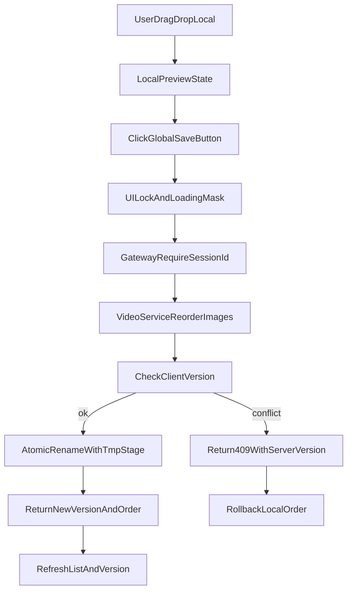

# 融合平台视频重排优化执行方案（全局保存版）

## 目标与已确认决策

基于你的最新决定，本方案改为：

- 拖拽只做本地预览，不立即请求后端。
- 使用一个全局“保存顺序”按钮统一提交。
- 在点击保存前，图片列表与内容栏都先本地预览新顺序。
- 保存成功后再落库并生效文件前缀顺序。

已固定提示语：

- 保存成功：`顺序已保存`
- 冲突：`内容已被其他操作更新，请刷新后重试`
- 非冲突失败回滚：`重排失败，已恢复原顺序`

## 需更新的核心文件

- 前端主页面：[VideoGeneration.vue](/root/work/ronghe-platform/frontend/src/views/VideoGeneration.vue)
- 网关转发与会话校验：[server.js](/root/work/ronghe-platform/api-gateway/server.js)
- 视频服务重排与文件防御：[app.py](/root/work/ronghe-platform/video-service/app.py)

## 架构流程（保存按钮版）

## 分阶段实施

## M1：前端交互模型改造（拖拽预览 + 全局保存）

在 [VideoGeneration.vue](/root/work/ronghe-platform/frontend/src/views/VideoGeneration.vue) 中：

- 新增全局按钮：`保存顺序`（仅当存在未保存改动时可点）。
- 拖拽后仅更新本地状态（可变/固定两栏），不发接口。
- 同步更新内容栏（本地预览），但标记为 `dirty`。
- 保存时一次性提交当前两栏最终顺序。
- 保存期间 UI 锁定：
  - 禁止继续拖拽
  - 列表半透明遮罩 + “正在保存顺序，请稍候”
- 防呆提醒（你新增要求，P0）：
  - 拖拽产生未保存改动后，`保存顺序`按钮高亮并显示“有未保存改动”状态。
  - 未保存时点击“生成视频”必须先弹窗确认：`您有未保存的顺序改动，是否先保存？`
    - 用户选择“先保存”：执行保存成功后再继续生成视频。
    - 用户选择“放弃改动并继续”：回滚到已保存快照后再生成视频。
    - 用户选择“取消”：中止生成流程。
  - 未保存时点击“重新识别并下载”也触发同类确认，防止误覆盖本地排序预览。
  - 页面离开保护：`beforeunload` 提示未保存改动（浏览器标准文案）。

### M1.1：单一真实来源（Single Source of Truth，P0）

- 禁止“图片列表”与“内容栏 textarea”同时作为主状态源。
- 以 `orderedItems`（或等价结构：可变/固定各一数组，元素含 `filename`、`sourceUrl` 等）为唯一权威顺序。
- 内容栏展示文本由 `orderedItems` **派生计算**（computed / 纯函数拼接），拖拽只改 `orderedItems`，再刷新派生文本。
- 保存请求 payload 仅由 `orderedItems` + `lastKnownVersion` 组装。
- 价值：杜绝“图序改了链接没改”或双向同步遗漏。

## M2：并发与自动同步协调（避免死锁与双流）

在 [VideoGeneration.vue](/root/work/ronghe-platform/frontend/src/views/VideoGeneration.vue) 中：

- 引入统一状态机：`idle | editing | saving | rollback`。
- 保存动作发起时挂起自动同步轮询。
- 增加超时恢复机制：挂起上限 30 秒，超时强制恢复自动同步。
- 保存 `finally` 必恢复自动同步（双保险：finally + watchdog）。
- 继续保留手动重识别的任务互斥与取消逻辑，避免旧下载任务残留。

### M2.1：重新识别并下载进程治理（重点补充）

问题背景（你明确要求补充）：当前“重新识别并下载”在旧任务未结束时再次触发，会出现旧任务和新任务并行、双进度条同时跑、结果互相覆盖。

在 [VideoGeneration.vue](/root/work/ronghe-platform/frontend/src/views/VideoGeneration.vue) 中增加以下机制：

- 双栏位独立任务控制器（`variable` / `fixed`）：
  - `activeTaskId`
  - `AbortController`
  - `isRunning`
  - `progressState`
- 点击“重新识别并下载”时统一走 `restartRecognitionTask(slot)`：

  1. 取消旧任务（`abort`）
  2. 清空旧进度条与旧计时器
  3. 失效旧 `taskId`
  4. 启动新任务并绑定新 `taskId`

- 循环下载链路增加“任务身份校验”：
  - 每次发请求前后都校验 `taskId === activeTaskId`，不一致立即退出，不再写 UI。
- 异步闭包防护（实现细节约束）：
  - 在每个异步分支内使用局部快照 `const taskIdSnapshot = currentTaskId` 做判定。
  - 禁止直接在延迟回调中读取可变全局任务ID，避免“旧回调拿到新任务ID”导致错写 UI。
- 进度条采用“任务命名空间”：
  - 仅允许当前任务更新对应进度 DOM，旧任务回包直接丢弃。
- 手动触发优先级高于自动触发：
  - 手动重识别期间自动同步不抢占下载链路。

验收标准（针对该问题）：

- 下载未完成时重复点击“重新识别并下载”，页面只存在一个有效进度流。
- 不出现“双进度条并行增长”或“旧任务回包覆盖新任务结果”。
- 新任务完成后列表与内容栏与该次触发输入一致。

## M3：接口契约升级（版本与会话强约束）

### 3.1 网关层

在 [server.js](/root/work/ronghe-platform/api-gateway/server.js) 中：

- 新增/调整重排接口代理：`POST /api/video-generation/api/reorder-images`。
- 强制要求 `x-session-id`，缺失直接 `400`，不再使用 `default/sid_shared_default` 兜底。
- 透传 `client_version` 与两栏顺序数据。

### 3.2 视频服务层

在 [app.py](/root/work/ronghe-platform/video-service/app.py) 中：

- 新增 `POST /api/reorder-images`。
- 入参：`client_version`、`variable_order`、`fixed_order`。
- 校验版本：不一致返回 `409` + `server_version`。
- 成功后返回：`new_version` + `normalized_order`。

## M4：后端重命名防御与原子性

在 [app.py](/root/work/ronghe-platform/video-service/app.py) 中：

- 两阶段原子重命名：`原名 -> __tmp__* -> 001_*`。
- 防御性编程（你新增要求）：
  - 路径合法性校验（禁止越权路径与异常文件名）
  - 仅处理“当前会话目录内、在提交清单中的文件”
  - 忽略手动乱放或不在清单内的无关文件
  - 处理重名冲突检测，禁止覆盖
- 会话内锁：按 `(session_id, folder_type)` 互斥，避免同会话并发重排。
- 孤儿临时文件自愈（P0 基线）：
  - `reorder-images` 入口先做**轻量检测**：是否存在 `__tmp__*` 前缀文件（或等价 glob），有则进入自愈分支。
  - 若发现脏临时文件，先执行自愈回滚流程（恢复原命名或清理可判定临时残留），再进入本次重排。
  - 将“自愈动作”和结果写入审计日志，便于定位历史异常。
- 性能优化（P1，可选）：
  - 不必每次重排都做重目录全扫：在重命名 `try/except` 捕获异常时，写入会话目录 `metadata.json`（或后续 Redis）标记 `tmp_dirty: true`。
  - 下一次 `reorder-images`：**若标记为 true 则执行深扫/完整自愈**；成功完成后清除标记。
  - 无标记时仅轻量存在性检测，降低几百张图场景下的 IO 压力。

## M5：版本心跳与冲突体验优化

在 [VideoGeneration.vue](/root/work/ronghe-platform/frontend/src/views/VideoGeneration.vue) 中：

- 首帧强制同步（P0）：在 `onMounted` / 页面初始化完成后的**第一次**拉取列表时，必须从后端拿到 `serverVersion` 并写入 `lastKnownVersion`，再允许用户点击「保存顺序」。避免缓存或旧内存导致首发 409。
- 每次轮询/刷新列表时同步 `lastKnownVersion`（版本心跳）。
- 保存时提交最新 `lastKnownVersion`，减少非必要 409。
- 收到 409：
  - 本地回滚到 `preDragSnapshot`
  - 弹出固定文案：`内容已被其他操作更新，请刷新后重试`
- 非 409 错误：
  - 本地回滚
  - 弹出：`重排失败，已恢复原顺序`
- 日志审计（P0）：
  - 网关与视频服务都记录最小审计日志：
    - `session_id`
    - `folder_type`
    - `client_version -> server_version/new_version`
    - `result`（success/conflict/failed）
    - `stage`（gateway_validate / version_check / rename / rollback）
  - 目标是用户反馈“顺序变乱”时可快速定位故障阶段。

## M6：目录与文档落位（项目内计划路径）

团队可读副本与本机 Cursor 计划保持同步：

- 计划目录：`/root/work/ronghe-platform/plan/`
- 本文档：`/root/work/ronghe-platform/plan/video-reorder-manual-save-plan.md`
- Cursor 侧副本：`.cursor/plans/video-reorder-manual-save-plan_9ad4e2f3.plan.md`（文件名以 Cursor 生成为准）

## 验收标准（上线前必须全部通过）

- 顺序状态仅以 `orderedItems` 为源；textarea 与列表展示与其派生结果一致，无双向分叉。
- 首帧已从后端同步 `version` 后，`保存顺序` 才可用；未同步前按钮禁用或明确提示。
- 拖拽不会触发后端请求，只有点“保存顺序”才请求。
- 保存期间列表锁定且有明确加载遮罩。
- 有未保存改动时点击“生成视频”必弹确认，不允许静默覆盖排序。
- 有未保存改动时离开页面有浏览器级提醒。
- 重新识别并下载在重复触发时只保留一个有效任务，不出现双进度并发。
- 保存成功后图片顺序、内容栏顺序、前缀顺序一致。
- 同会话并发保存不出现半重排。
- 缺失 `x-session-id` 的重排请求被拒绝。
- 轮询长期运行下不会因挂起导致“永不恢复”。
- 存在 `__tmp__` 脏文件时系统可自愈，不影响后续保存流程。
